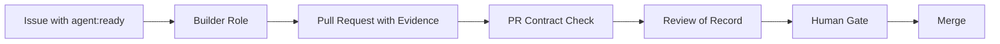

# AI Operating System Starter

A GitHub-centered starter kit for AI-assisted project work.

Use it when you want AI agents to work on real tickets, produce reviewable pull requests, and stay under human control.

Most AI coding workflows fail for the same reason: context gets lost, work happens in chat, reviews become vague and nobody knows what is safe to merge.

This starter turns AI-assisted work into a visible GitHub workflow: tickets, roles, pull requests, evidence, review signals and a human gate.

The operating model is simple:

- GitHub is the operational source of truth.
- Issues define the work.
- Pull requests deliver evidence.
- Reviews create decision signals.
- Humans keep the final gate.
- The AI Vault is project memory and strategy, not the task system.

This starter is for teams and solo builders using AI agents without losing control of scope, review, evidence or decisions.

## 2-Minute Start

1. Click [Use this template](https://github.com/Suumth/Betriebssystem-Starter/generate).
2. Create a new repository for your project.
3. Clone your new repository locally.
4. Run the setup script:

```bash
bash scripts/setup.sh
```

Then run one safe AI-assisted loop with [`FIRST_LOOP.md`](FIRST_LOOP.md).

After setup you have:

- `PROJECT.md` as the router for AI tools
- `AGENTS.md` with agent rules and boundaries
- GitHub labels and templates
- an AI Vault starter area
- a Ticket 0 pattern for the first agent loop

Use [`START_HERE.md`](START_HERE.md) after the first loop for the deeper method.

## How the Workflow Works

The starter does not run hidden background agents. It gives you a clear operating model for invoking agent roles through Codex, Claude Code, Cursor, Copilot Workspace or another AI tool.

1. A human creates or chooses a GitHub Issue.
2. The human starts an AI tool and gives it a role: Builder, Reviewer, Researcher, Tester or PM Signal.
3. The role works from `PROJECT.md`, `AGENTS.md`, the issue, contracts and prompts.
4. The agent produces a pull request, review comment, research note or PM signal.
5. Evidence is attached to the work, not left in a private chat.
6. The Review of Record creates the decision signal.
7. The human keeps the final Human Gate for merge, release and protected decisions.

## Core Loop Diagram



## Why It Helps

- less context lost between AI sessions
- clearer tickets, scope and stop conditions
- reviewable pull requests instead of invisible chat output
- evidence before merge decisions
- safer handoff between builder, reviewer and PM roles
- GitHub remains the operational source of truth
- the AI Vault remains memory and strategy, not the task system

## What This Repo Is Not

- not an autonomous runner
- not a background subagent orchestrator
- not a replacement for GitHub Issues or pull requests
- not a replacement for human product decisions
- not a place for private strategies, customer data or credentials
- not a finished dashboard or SaaS product

## Deutsche Kurzfassung

Ein GitHub-zentrierter Starter für KI-gestützte Projektarbeit.

Für Teams und Solo-Builder, die mit KI-Agenten arbeiten wollen, ohne die Kontrolle über Tickets, Pull Requests, Evidence und menschliche Entscheidungen zu verlieren.

Der Starter startet keine versteckten Subagents. Er liefert Rollen, Prompts, Contracts und Routing, damit du Codex, Claude Code, Cursor oder ein anderes AI-Tool gezielt als Builder, Reviewer, Researcher, Tester oder PM-Signal-Geber beauftragen kannst.

Du nutzt dieses Repo als Template, führst einmal `scripts/setup.sh` aus und startest danach Ticket 0 in deinem eigenen Projekt.

Die operative Logik bleibt einfach:

- GitHub ist die operative Wahrheit für Issues, PRs, Labels, Reviews und Evidence.
- Der AI Vault ist Projektgedächtnis und Strategie, nicht der operative Tasklog.
- `PROJECT.md` routet jedes Projekt.
- `AGENTS.md` beschreibt Agentenrollen, Grenzen und Stop-Regeln.
- Issues sind Arbeit.
- PRs sind Lieferung.
- Evidence entscheidet.
- Der Mensch bleibt das Human Gate.

## Für wen?

- Für Produkt- und Engineering-Teams, die Agentenarbeit reproduzierbar machen wollen.
- Für Einzelpersonen, die Projekte mit klaren Tickets, Reviews und Evidence führen wollen.
- Für Organisationen, die AI-Tooling nutzen wollen, ohne operative Wahrheit aus GitHub herauszuziehen.

## Package Contents

The package includes:

- an AI operating system method folder with contracts, templates, prompts, skills, PM loops and migration notes
- an AI Vault starter structure for strategy, decisions, risks, lessons and project memory
- a demo project with `PROJECT.md`, `AGENTS.md`, labels, ticket example and PR template
- a demo vault showing how project context can be structured outside the operative repo
- public readiness checks to keep the starter package clean before sharing

The goal is not to replace GitHub, Jira, Obsidian or AI tools. The goal is to connect them with a small, explicit operating model so AI agents can work on real tickets, produce reviewable results and remain under human control.

## Was ist enthalten?

- `START_HERE.md` ist der vertiefende Einstieg nach dem Quickstart.
- `ai-betriebssystem/` enthält Methode, Contracts, Templates, Prompts, Skills, PM-Loop, Migration und neutrale Beispiele.
- `ai-vault/` ist eine leere, sinnvolle Vault-Erstinstallation für Obsidian oder einen Markdown-Editor.
- `config/` dokumentiert die personalisierbaren Werte und den Placeholder-Contract.
- `examples/demo-project/` zeigt ein neutrales Projekt-Repo mit `PROJECT.md`, `AGENTS.md`, Labels, Ticket 0 und PR-Template.
- `examples/demo-vault/` zeigt, wie ein Vault-Projektbereich zum Demo-Projekt aussieht.
- `docs/first-installation.md` und `docs/first-project.md` erklären die Installation und das erste Projekt im Detail.
- `public-readiness/` dokumentiert Inventar, Sanitization und Release-Checks.
- `scripts/public-readiness-check.sh` prüft private Treffer, sensible Treffer, Pflichtdateien, Pflichtlabels und lokale Altlasten.

## Nach dem Setup

1. Starte mit `FIRST_LOOP.md`.
2. Füll bei Bedarf `setup.local.env`; die Vorlage liegt in `config/starter.config.example`.
3. Lege Ticket 0 im Projekt-Repo an, falls setup es nicht erstellt hat.
4. Stoppe vor Merge am Human Gate.
5. Lies danach `START_HERE.md` fuer den tieferen Methoden-Kontext.
6. Öffne `ai-vault/` in Obsidian oder einem Markdown-Editor, wenn du nach dem ersten PR Projektgedächtnis pflegen willst.
7. Nutze die Label-Semantik aus `ai-betriebssystem/contracts/labels.md` und `ai-betriebssystem/templates/labels.yml`.
8. Führe vor jeder Weitergabe `bash scripts/public-readiness-check.sh` aus.

## Wichtige Grenze

Der Starter enthält keine privaten Projekte, keine echten Roadmaps, keine echten Issue- oder PR-Historien, keine lokalen Pfade und keine Secrets.
